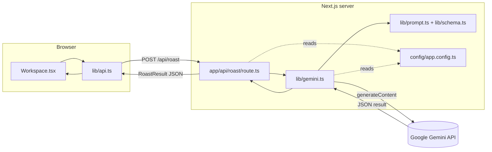
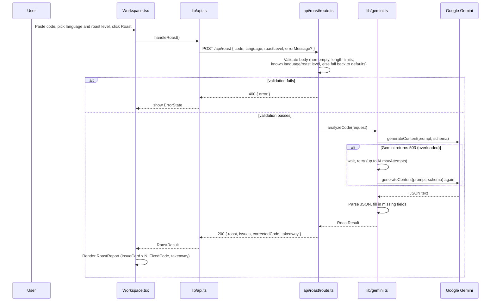
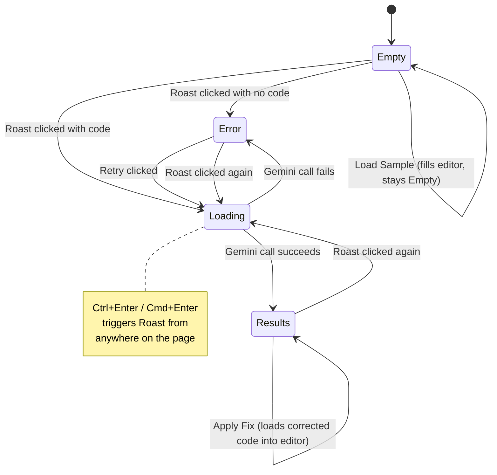
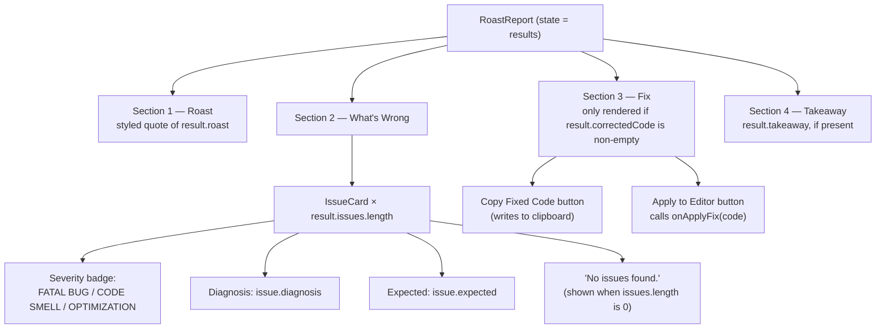

# Code Roaster

Paste your code and get a witty roast, a list of issues, and the corrected code — powered by Google Gemini.

Built with **Next.js 16 (App Router)**, **React 19**, **TypeScript**, **Tailwind CSS 4**, and the **`@google/genai` SDK**.

---

## 1. Setup

**Requirements:** Node.js 20.9 or newer (check with `node -v`).

```bash
# 1. Install dependencies
npm install

# 2. Create your env file from the template
cp .env.example .env.local        # Windows (cmd): copy .env.example .env.local

# 3. Open .env.local and paste your key from https://aistudio.google.com/apikey

# 4. (Optional) Check that the key works
npm run check:api

# 5. Start the app
npm run dev
```

Then open **http://localhost:3000**.

## 2. Scripts

| Command             | What it does                                      |
| -------------------- | -------------------------------------------------- |
| `npm run dev`        | Starts the dev server with hot reload               |
| `npm run build`      | Creates a production build                          |
| `npm start`          | Runs the production build                           |
| `npm run lint`       | Checks the code with ESLint                         |
| `npm run check:api`  | Tests your Gemini API key without starting the UI    |

## 3. Architecture

The app is a single Next.js project. The browser never talks to Gemini directly — it only calls the app's own API route, which is the only place the API key is read.



## 4. Request flow (a single roast)



## 5. UI flow

`Workspace.tsx` owns a single `reportState` value (`"empty" | "loading" | "results" | "error"`, from `types/roast.ts`), and `RoastReport.tsx` renders exactly one panel for whichever state it is. This is the full set of states and the actions that move between them:



Two things sit outside that state machine and can be used at any time regardless of the current state:

- The **error-message drawer** (`ErrorMessageInput`) opens and closes on its own `errorDrawerOpen` flag, so you can attach an error message to a roast without leaving whatever state you're in.
- The **first issue's line highlight** in `CodeEditor` only shows while `code === roastedCode` — it disappears the moment you edit the code that was just roasted, even though `reportState` is still `"results"`.

## 6. Results panel layout

When `reportState` is `"results"`, `RoastReport.tsx` builds the panel out of numbered sections from `SectionHeader`, `IssueCard`, and `FixedCode`. This is what it renders, and where each piece of text comes from:



Two details that are easy to miss when just looking at the UI: **Section 3 (Fix) only appears if `correctedCode` is non-empty**, and **Section 4's number shifts from 3 to 4 depending on whether Section 3 was rendered** — `RoastReport.tsx` computes it as `result.correctedCode ? 4 : 3`.

## 7. Project structure

```
code-roaster/
├── app/
│   ├── api/roast/route.ts   # Backend: POST /api/roast. Validates input, calls Gemini
│   ├── layout.tsx           # Root HTML layout, fonts, page title
│   ├── page.tsx             # Home page, renders <Workspace />
│   └── globals.css          # Tailwind + theme colours
│
├── components/               # UI (React)
│   ├── Workspace.tsx         # Main screen: holds all state, wires everything together
│   ├── TopBar.tsx            # Header with the app name
│   ├── RoastControls.tsx     # Roast level, language, and the Roast button
│   ├── ErrorMessageInput.tsx # Optional drawer to paste an error message
│   ├── CodeEditor.tsx        # Textarea with line numbers
│   ├── RoastReport.tsx       # Right panel: picks the empty/loading/error/results view
│   ├── SectionHeader.tsx     # "01 // ROAST" style headings
│   ├── IssueCard.tsx         # One issue found in the code
│   ├── FixedCode.tsx         # Corrected code with Copy / Apply buttons
│   ├── EmptyState.tsx        # Right panel before the first roast
│   ├── LoadingState.tsx      # Right panel while waiting
│   ├── ErrorState.tsx        # Right panel when something fails
│   └── StatusBar.tsx         # Footer
│
├── config/
│   └── app.config.ts         # Model, languages, roast levels, limits, sample code
│
├── lib/
│   ├── api.ts                 # Browser → calls our /api/roast route
│   ├── gemini.ts               # Server → calls Gemini (the API key is used only here)
│   ├── prompt.ts               # System prompt + builds the user prompt
│   └── schema.ts               # JSON shape Gemini must reply with
│
├── types/
│   └── roast.ts                # Shared TypeScript types (request, result, issue)
│
├── scripts/
│   └── check-api.ts            # `npm run check:api`
│
├── .env.example                 # Template for environment variables (committed)
└── .env.local                   # Your real API key (NOT committed)
```

## 8. Configuration

Everything below lives in `config/app.config.ts` unless noted otherwise, and drives both the UI and the API in sync:

| Setting                     | Current value(s)                                                                 |
| ---------------------------- | ---------------------------------------------------------------------------------- |
| Model                        | `gemini-3.5-flash-lite`                                                            |
| Retries on Gemini 503        | 3 attempts, with a short backoff between each                                      |
| Roast levels                 | `Dry` → `Sharp` → `Savage` (mildest to harshest)                                   |
| Supported languages          | Python, JavaScript, TypeScript, Java, C, C++, Go, Rust                             |
| Default language / level     | Python / Savage                                                                    |
| Issue severities             | `FATAL BUG`, `CODE SMELL`, `OPTIMIZATION`                                          |
| Max code length              | 20,000 characters                                                                   |
| Max error-message length     | 4,000 characters                                                                    |
| AI personality & rules       | `lib/prompt.ts` (Hinglish + emojis, per the system prompt)                         |
| Secrets (API key)            | `.env.local` (copy from `.env.example`)                                            |

Examples:

- **Add a language:** add `{ id: "kotlin", label: "Kotlin", extension: "kt" }` to `LANGUAGES` in `config/app.config.ts`.
- **Change the model:** edit `AI.model` (and `AI.modelLabel` for the footer).
- **Add a roast level:** add an entry to `ROAST_LEVELS`. The UI, the types, and the prompt all pick it up automatically.

## 9. Troubleshooting

| Problem                                   | Fix                                                                       |
| ------------------------------------------ | --------------------------------------------------------------------------- |
| `GEMINI_API_KEY is missing`                | Create `.env.local` from `.env.example`, then **restart** `npm run dev`.    |
| `Gemini rejected the request` / `denied`   | The API key is wrong or disabled. Make a new one in AI Studio.              |
| `Model "..." was not found`                | `AI.model` in `config/app.config.ts` points at a model your key can't use.  |
| `Gemini is overloaded`                     | Temporary on Google's side. The app retries automatically; try again.       |
| `Rate limit reached`                       | Free keys allow a limited number of requests per minute. Wait a bit.        |
| Copy button says "COPY BLOCKED"            | Clipboard access needs `localhost` or `https`. Select the code manually.    |

## 10. Status notes

A few things worth knowing that aren't obvious from the code alone:

- The `public/` folder still has Next.js's default boilerplate icons (`file.svg`, `globe.svg`, `next.svg`, `vercel.svg`, `window.svg`) rather than app-specific assets.
- Everything described above is implemented and working end-to-end — there's no half-built or planned-but-missing feature in the current codebase.
